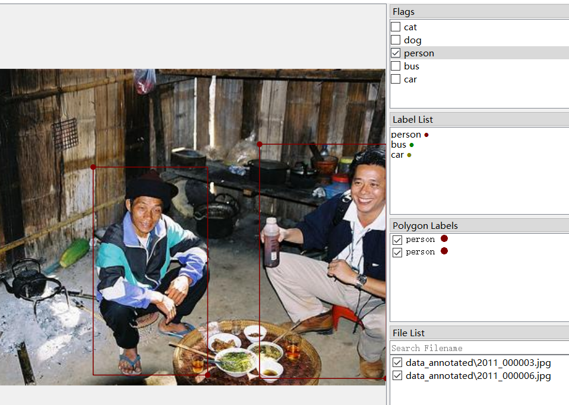

# LabelMe标注筛选

本项目实现了LabelMe通过标注筛选图片的功能。使用者勾选标注可以显示所有包含这些标注的图片。

## 安装

* 本项目依赖[LabelMe](https://github.com/wkentaro/labelme)库，需要先进行安装。

* 将我们库中的app.py复制，替换安装好的labelme库中的app.py文件。以anaconda的base环境为例，将```.\anaconda3\Lib\site-packages\labelme```路径下的app.py替换为本项目中的app.py：

  

  

* 创建flags.txt文件，并将你想筛选的标注添加到文件中。注意每一个标注要单独占一行，并且一行标注的开头和末尾不能有空格。

  

  

* 在命令行启动时添加```--flags```参数，传入flags.txt的地址，例如

```labelme data_annotated --flags data_annotated/flags.txt ```

## 使用

勾选标签，在File List里图片列表会仅显示含有标签的的图片：

